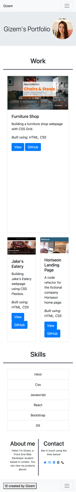

# Bootstrap Portfolio

## Table of Contents

- [Description](#description)
- [Installation](#installation)
- [Usage](#usage)
- [Credits](#credits)
- [License](#license)

## Description

A Bootstrap-powered portfolio website with sections such as Navigation, Hero, Work, Skills, About & Contact and Footer. Bootstrap 4.4 and Font Awesome were used for styling.

## Installation

1. Clone the GitHub repository
2. Open the VS Code with the project.
3. Right click the file index.html and select `"open with live server"`.

## Usage

The site is deployed here: https://gizem03.github.io/bootstrap-portfolio/.

When you deploy or run the application you will see the following site on your browser.

Desktop:

Mobile:

## Credits

- https://getbootstrap.com/docs/4.4/getting-started/introduction/
- https://css-tricks.com/snippets/css/complete-guide-grid/
- https://developer.mozilla.org/en-US/docs/Learn/CSS/CSS_layout/Flexbox
- https://fontawesome.com/icons

## License

This project is using MIT license. You can view the license [here](license.txt).
